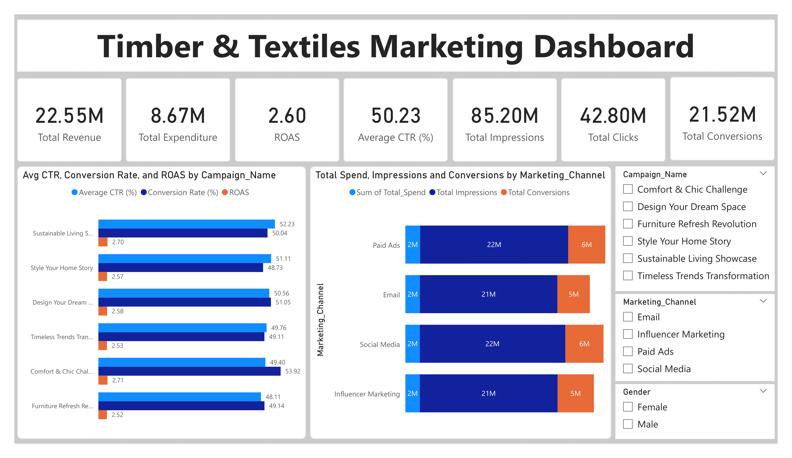
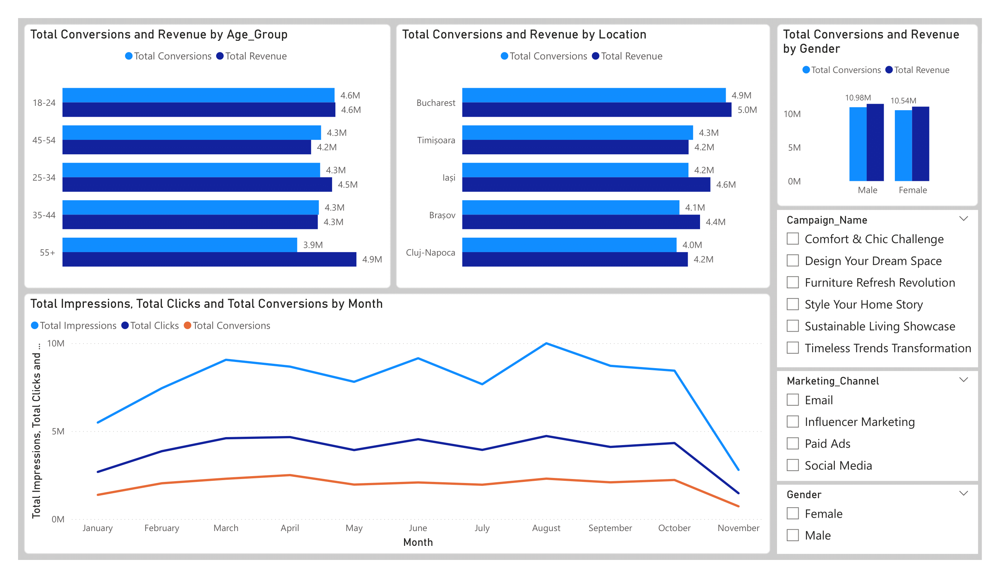
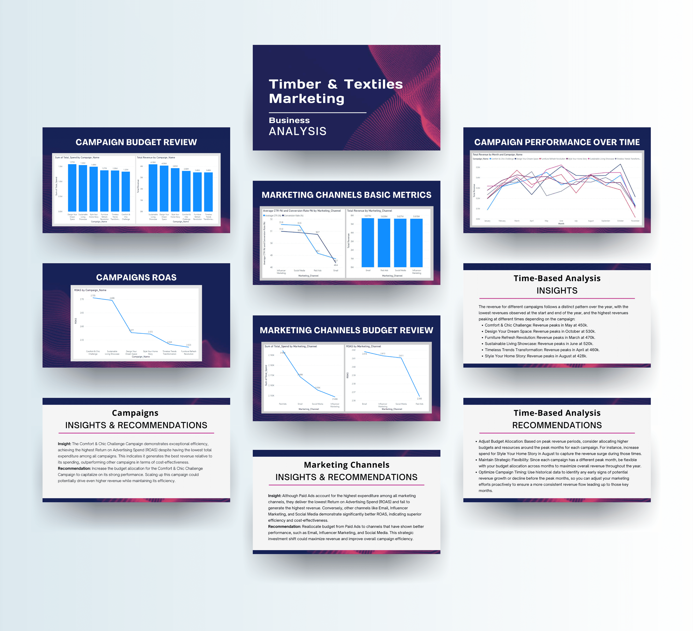

# Timber & Textile Marketing Dashboard  
An interactive Power BI dashboard and report designed to evaluate marketing campaign performance for the timber and textile industries. 
The project provides key insights into campaign effectiveness, demographic engagement, and budget optimization.  

## Features  
- Analyze campaign metrics: CTR, conversion rate, ROAS, and CPC.  
- Compare channel performance and identify top-performing channels.  
- Segment data by demographics (age, gender, location) for targeted insights.  
- Monitor trends over time to uncover seasonal patterns.  
- Deliver actionable recommendations via a visually engaging report using Canva and PowerPoint.
- Provide filters to allow users to customize the dashboard view based on specific criteria, such as date ranges, channels, or demographics.  

## Dashboard  

    
    

  

## Report Samples

 

## Tools  
- **Power BI**: Dashboard creation and data visualization.  
- **PowerPoint & Canva**: Report design and presentation.  
